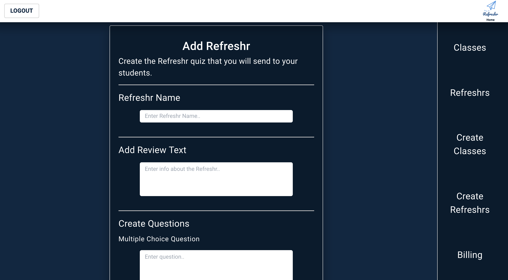

### Accomplishments this week

This week our team polished our project by improving styling, removing bugs and error messages.

I personally worked on improving the styling of the Refreshr page, Edit Refreshr page as well as refactoring existing code to improve readability.

The Edit Refreshr page required additional functionality as I needed to create a Put request to the Typeform API. This enabled the teacher to edit the forms that they've created.

### Working in a team

Working in a team near the end of the project has been enjoyable and a great learning experience. Updating styling and removing bugs often feels like it will take a small amount of time but it ends up taking significantly longer than expected.

Our team is very good at communicating. We have video meetings at least twice per day to go through what we're working on and what we're going to do next. This has helped to speed up the process significantly and helped to reduce the risk of merge conflicts.

## Tasks Pulled

- Task: Make Edit Refreshr page functional
- Trello: https://trello.com/c/zJNAqpJm/129-edit-refreshr-form
- Github: https://github.com/Lambda-School-Labs/labs10-student-follow/pull/153

---

- Task: Landing Page Updates
- Trello: https://trello.com/c/P27R6Vvq/134-align-left-styling-changes
- Github: https://github.com/Lambda-School-Labs/labs10-student-follow/pull/164

---

#### Detailed Analysis on Edit Refreshr Functionality

I worked on enabling the teacher to edit the Refreshr that they have previously created. I needed to get the data from the previously created Refreshr and render it to the screen.

I then added conditional rendering. The teacher initially sees the text from the Refreshr. They can then click the Edit button to be able to change the text.

Here I did the put request to update the data in Typeform.

I then added conditional rendering logic.

And here is the final product.

