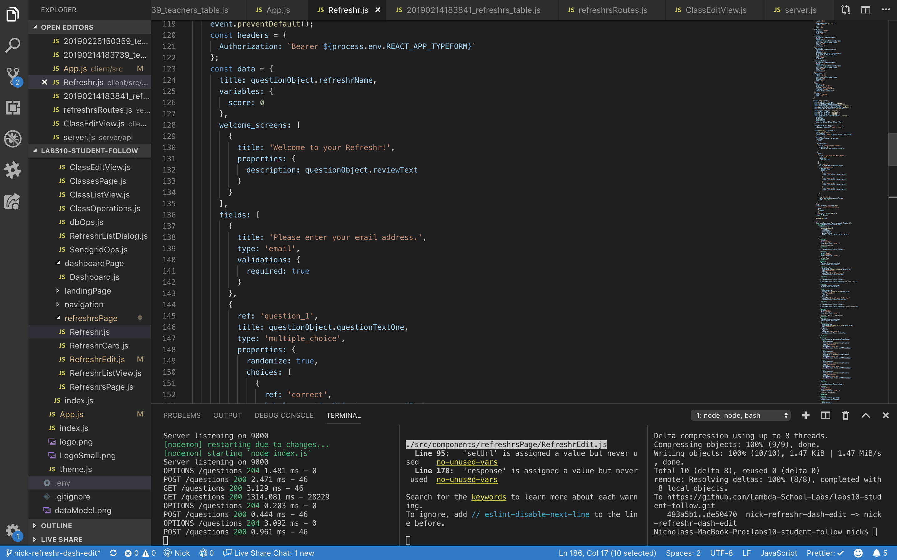
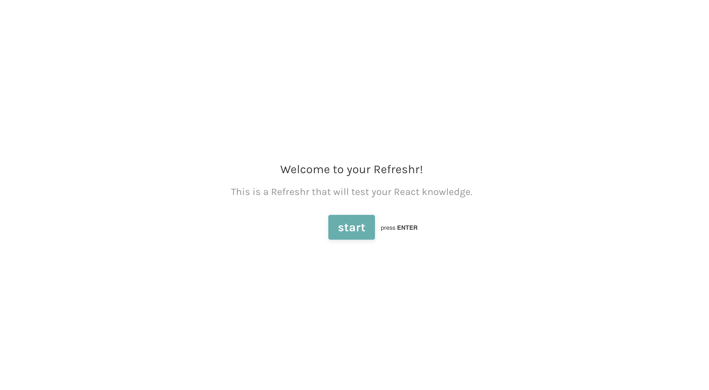
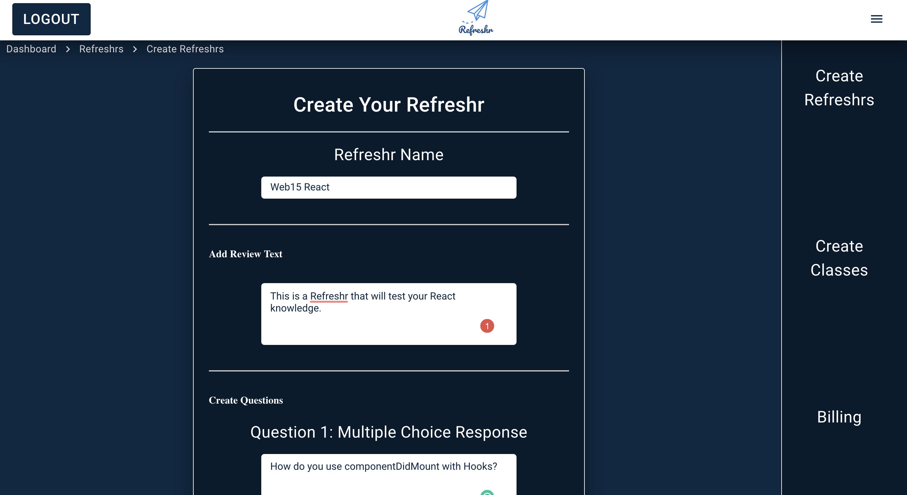

### Accomplishments this week

This week our team worked on bringing together the different parts of the site, styling, Auth0 Managmenet API, SendGrid API and Typeform's API.

We made improvements to the authentication process so that we have a teacher id when the teacher signs in. SendGrid is now sending email to our customers. We only need to work on scheduling the emails over a period of weeks now. We've styled the site with Material UI and kept the theme consistent throughout the site.

I personally working on integrating Typeform's API to create a professional Refreshr form for our users. This is now fully integrated with our website.

## Tasks Pulled

- Task: Get and post requests to Typeform's API
- Trello: https://trello.com/c/GNaCAqk1/92-typeform
- Github: https://github.com/Lambda-School-Labs/labs10-student-follow/pull/97

---

- Task: Integrate Typeform with our site
- Trello: https://trello.com/c/omAIzEVP/114-refreshr-page-updates
- Github: https://github.com/Lambda-School-Labs/labs10-student-follow/pull/102

---

- Task: Update Typeform with additional information
- Trello: https://trello.com/c/WRbgAJ8t/94-typeform-updates
- Github: https://github.com/Lambda-School-Labs/labs10-student-follow/pull/110

---

- Task: Refreshr Page Design
- Trello: https://trello.com/c/vnlS6vue/106-refreshr-page-design
- Github: https://github.com/Lambda-School-Labs/labs10-student-follow/pull/115

---

- Task: Add Review text to Typeform
- Trello: https://trello.com/c/vnlS6vue/106-refreshr-page-design
- Github: https://github.com/Lambda-School-Labs/labs10-student-follow/pull/121

---

#### Detailed Analysis on Typeform API

Typeform offers highly professional forms. I enjoyed using their platform before so I checked to see if they had a suitable API. Initially, there was a bug with their site and it wasn't possible to sign-up for a API access but after contacting their customer support, they were able to resolve this issue.

I created a post request in Postman and then built the code in Refreshr.js.

When the teacher enters their questions in the Refreshr.js page, a Typeform is created programatically. This creates a highly professional form for the students.

I then styled the Refreshr.js page to keep it consistent with the rest of our website.

