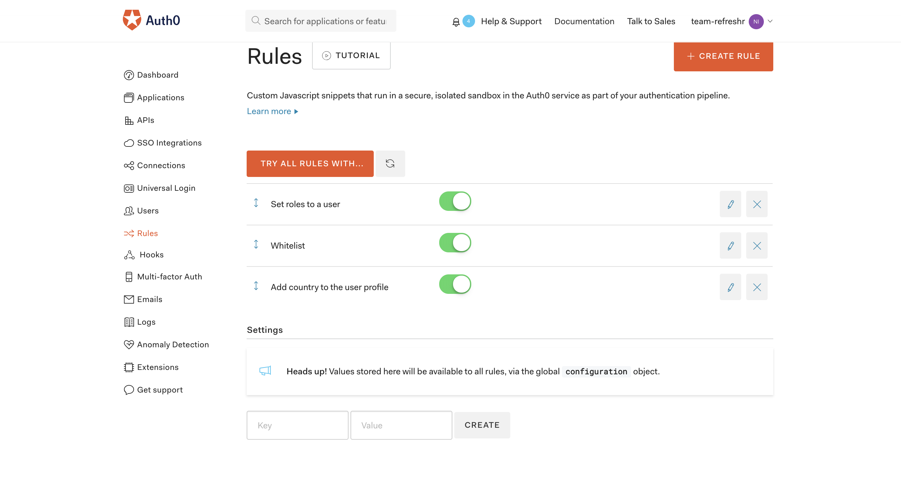
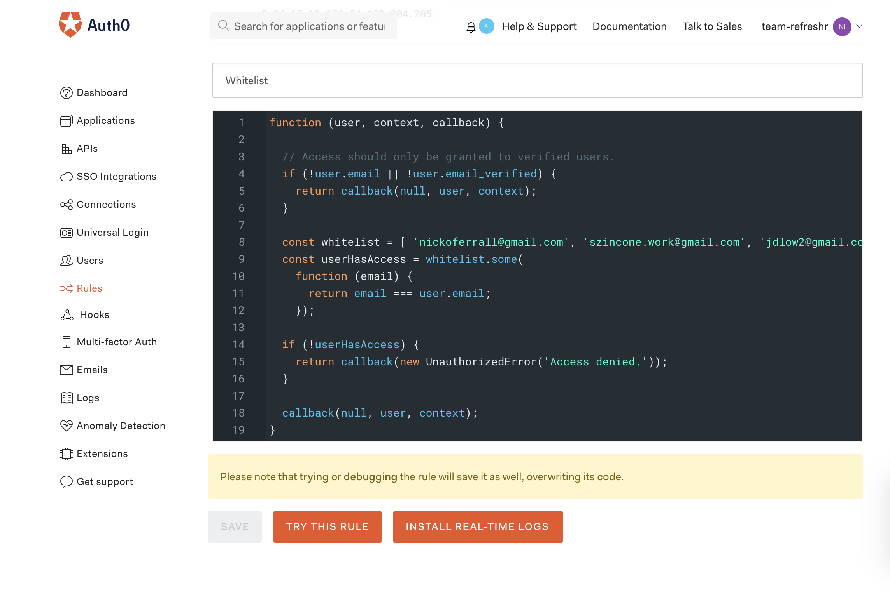
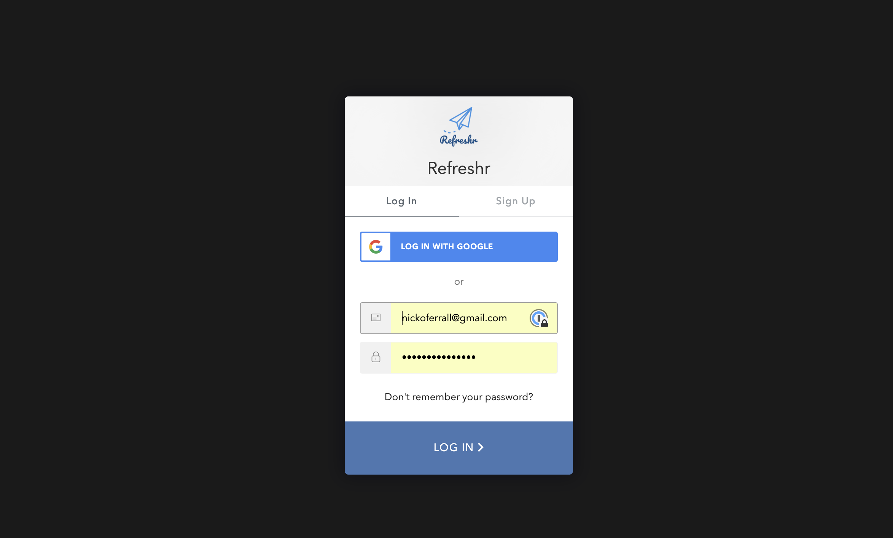

### Accomplishments this week

This week our team worked on SendGrid API, Auth0 Management API, the Refreshr (quizzes) questions and merge conflicts!

Our functionality is largely complete but bringing everything together has been challenging. Merge conflicts have slowed us down but we feel that we're nearly there in terms of functionality.

I personally worked on building the landing page, Auth0 and I've started working on Typeform too.

## Tasks Pulled

- Task: Landing Page V1
- Trello: https://trello.com/c/SuGSsJQb/2-landing-page-v1
- Github: https://github.com/Lambda-School-Labs/labs10-student-follow/pull/70

---

- Task: Landing Page Updates
- Trello: https://trello.com/c/JwJ85xfK/81-landing-page-updates
- Github: https://github.com/Lambda-School-Labs/labs10-student-follow/pull/78

---

- Task: Auth0 Management API
- Trello: https://trello.com/c/VC8jxOCO/83-auth0-management-api

---

#### Detailed Analysis on Auth0 Management

The Auth0 Management API provides functionality to add Rules to Auth0. The rules can include restricting access to only certain email address, IP addresses, locations and more.

We want to restrict access to protected routes to only authorised teachers. To do this, we created a rule that whitelists authorised email addresses.

Within each rule, you can manually edit the JavaScript provided by Auth0.

Now, only users that login with the whitelisted email addresses are provided access. User that login with a different email address, will get an unauthorized error.

