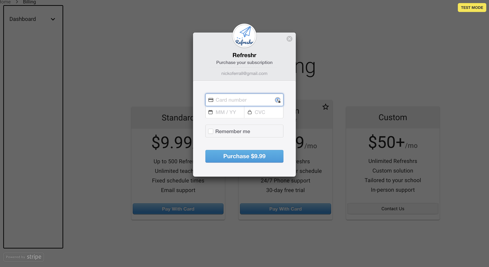
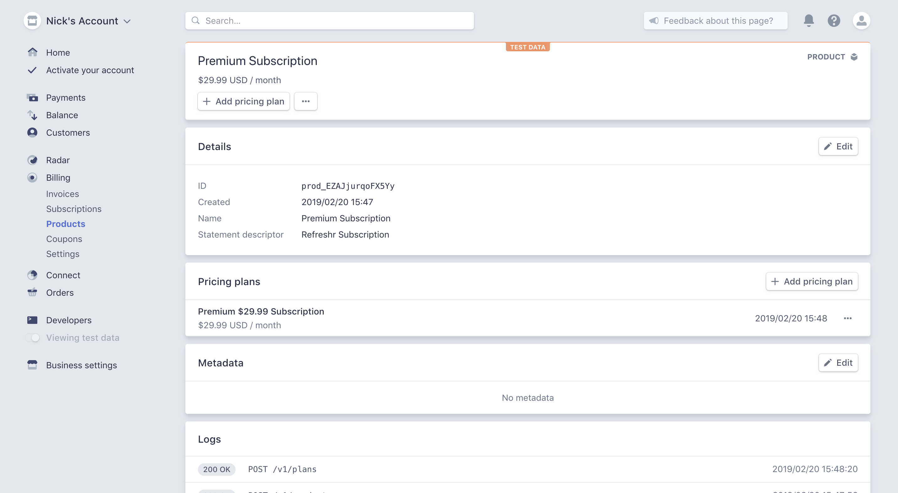
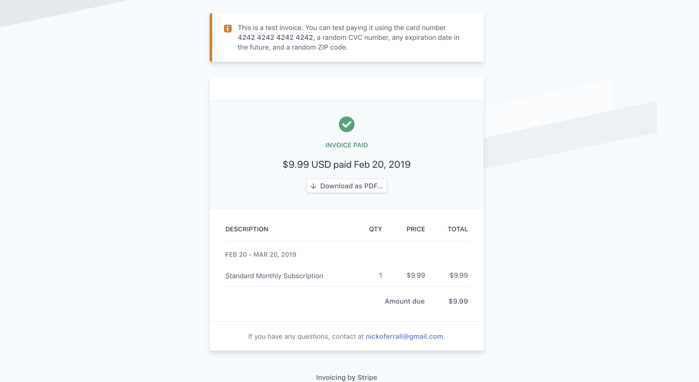
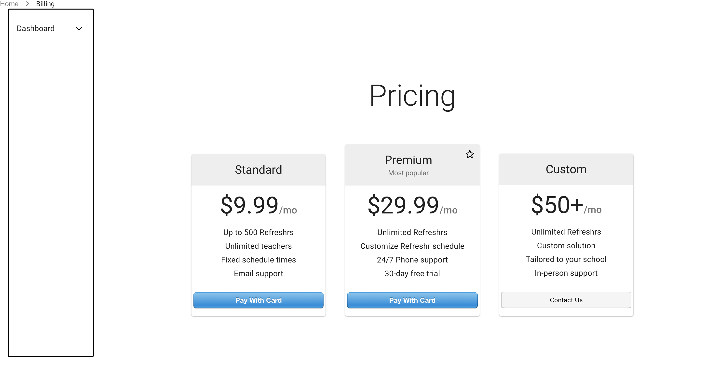

### Accomplishments this week

This week our team worked on intregrating all of our APIs. We successsfully integrated:

- Stripe subscription payments
- PapaParse for importing CSV files
- Connected the frontend to the backend Auth0
- SendGrid for sending emails

Additionally, we worked on using Material UI for design, explored React Hooks, got Postgres working locally, updated the database, helpers and axios requests.

This week I worked on integrating Stripe, setting up subscription payments with Stripe, Billing Page design with material UI and helped the team with Auth0 and SendGrid.

## Tasks Pulled

- Task: Added react-stripe-checkout library
- Trello: https://trello.com/c/5IgSh72J/60-update-stripe-functionality
- https://github.com/Lambda-School-Labs/labs10-student-follow/pull/39

---

- Task: Integrate Stripe subscription payments
- Trello: https://trello.com/c/fiiBrfPg/61-recurring-payments-functionality
- Github: https://github.com/Lambda-School-Labs/labs10-student-follow/pull/50

---

- Task: Use Material UI for billing page styling
- Trello: https://trello.com/c/tQKiWx1N/73-billing-page-pricing-display-change
- Github: https://github.com/Lambda-School-Labs/labs10-student-follow/pull/56

---

- Task: Update custom pricing section in Billing Page
- Trello: https://trello.com/c/WHzzmXym/76-update-custom-pricing-section-in-billing-page
- Github: https://github.com/Lambda-School-Labs/labs10-student-follow/pull/65

---

#### Detailed Analysis on Stripe Integration

Stripe is an industry leader in secure payments. They have built their product for developers. Rather than handling client payment information, Stripe handles the sensitive data and returns a token which can be used to charge a card.

I used the react-stripe-checkout library so that the user is taken to Stripe professionally designed payment page, as pictured below.
The library was easy to use, provided a professional payment form that can be customized.

Rather than creating a one-off payment, I wanted to set-up subscription payments to charge customers every month.
To do this, I created a product and a plan with the standard and premium payment options. Initially I did this programatically, but decided to remove the code as plans don't need to be created on-the-fly in this project.

I then created a customer programatically and assigned a plan based on what the user selected. Once a user submits their card details, they will receive an Refreshr invoice.

Finally, I used Material UI to improve the styling of the Billing Page. If the user selects the Custom option, they're taken to their email client. I will update this with a custom form later in the project.

